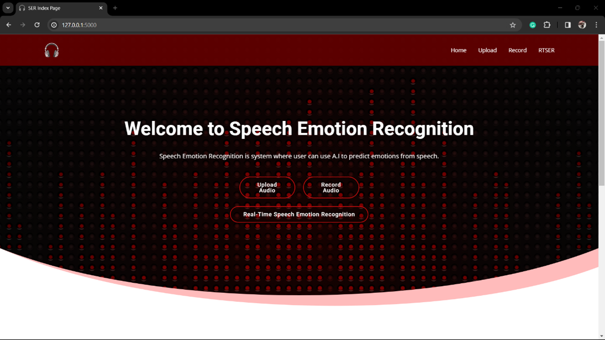
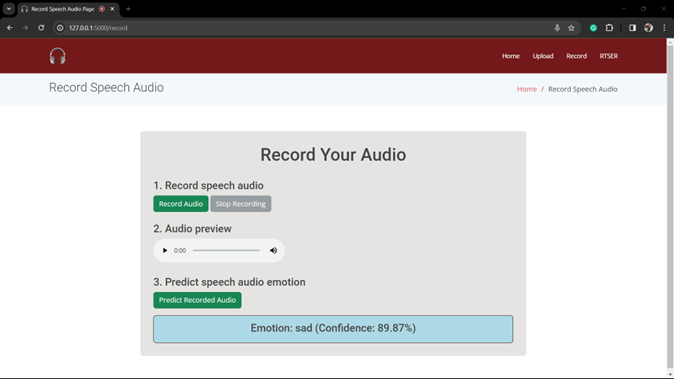
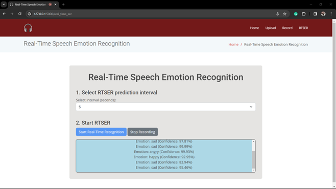
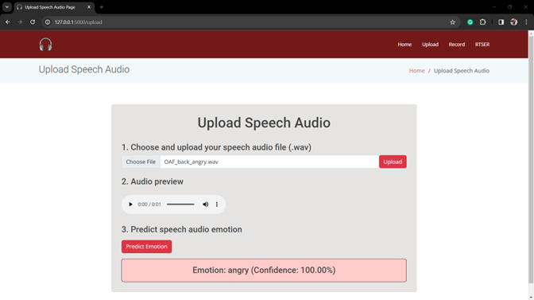

# Speech Emotion Recognition (SER) Project

This project provides tools for recognizing emotions from speech using a deep learning model. It includes:

- A Jupyter notebook (SERv2.ipynb) for training a Speech Emotion Recognition (SER) model on selected emotions.
- A web application built with Flask to perform real-time and file-based emotion recognition using the trained model.

## Dataset
This project uses speech datasets that include samples for four emotions: Neutral, Happy, Sad, and Angry.

## Dataset Links
You can download the datasets from the following links:

- **RAVDESS Dataset:** https://www.kaggle.com/datasets/uwrfkaggler/ravdess-emotional-speech-audio
- **CREMA-D Dataset:** https://www.kaggle.com/datasets/ejlok1/cremad
- **TESS Dataset:** https://www.kaggle.com/datasets/ejlok1/surrey-audiovisual-expressed-emotion-savee
- **SAVEE Dataset:** https://www.kaggle.com/datasets/ejlok1/toronto-emotional-speech-set-tess

Once downloaded, arrange the datasets in a Datasets folder according to the structure expected by the SERv2.ipynb notebook. Only samples from the Neutral, Happy, Sad, and Angry categories are required for this project.

## Setup Instructions
### 1. Set Up a Virtual Environment
To manage dependencies and avoid conflicts, it’s recommended to create a virtual environment:

```bash
Copy code
python -m venv SER
```

Activate the virtual environment:

- On macOS and Linux:
```bash
source SER/bin/activate
```

- On Windows:
```bash
SER\Scripts\activate
```

## 2. Install Required Libraries
Install the necessary libraries using the requirements.txt file:
```bash
pip install -r requirements.txt
```

## 3. Set Up ffmpeg
The **ffmpeg** tool is required for audio processing in this project, particularly for audio conversion. Download **ffmpeg** from the official site and add it to your system’s PATH environment variable. This ensures that the Flask app can handle audio files effectively.

## 4. Running the Training Notebook
To train or fine-tune the model, open **SERv2.ipynb** in Jupyter Notebook, adjust any parameters as needed, and run all cells. The notebook will guide you through loading and processing the datasets, augmenting data, and training the model.

## 5. Running the Web Application
The web application allows users to upload audio files or use real-time audio input to classify emotions. It uses a pre-trained model (**SERv3.h5**) located in the **website** folder. Follow these steps to run the application:

### 1. Navigate to the website directory:
```bash
cd website
```
### 2. Run the application:
```bash
flask run
```
### 3. Open your browser and go to http://127.0.0.1:5000 to access the application interface.

The application supports three main features:

- Upload Speech Audio: Upload a .wav file to get an emotion prediction.
- Record Speech Audio: Record audio in real time using your microphone and analyze the emotion.
- Real-Time Speech Emotion Recognition: Use a live microphone input for continuous emotion recognition.

## Acknowledgments

This project leverages several key libraries and tools:

- Librosa for audio processing and feature extraction.
- Flask for the web application framework.
- Keras for deep learning model creation and training.
- ffmpeg for handling audio file conversions.

## UI Images
1. Home Page


2. Record Page


3. RTSER Page


4. Upload Page


Thank you for using this project!
